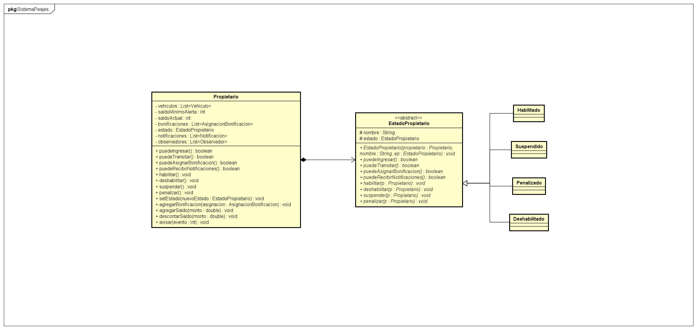
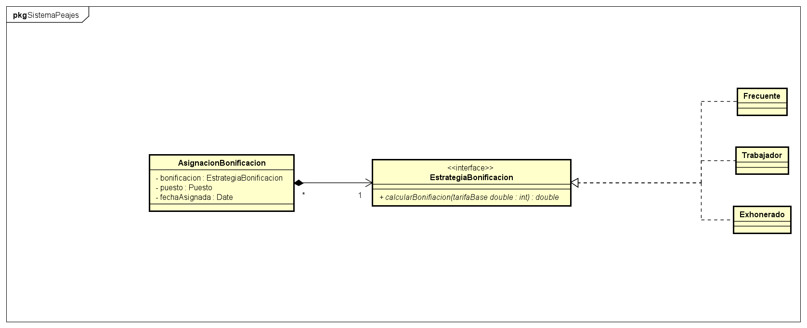

# Sistema de Gestión de Peajes – Spring Boot

Aplicación web para la gestión de un sistema de peajes, desarrollada en **Java y Spring Boot**, con foco en diseño de software, reglas de negocio y arquitectura orientada a dominio.

El proyecto fue realizado en el marco académico de la materia **Diseño de Aplicaciones** (Universidad ORT Uruguay), priorizando la aplicación de **patrones de diseño**, **principios GRASP** y buenas prácticas de estructuración del código.

---

## Descripción general

El sistema permite:
- Administrar el cobro de peajes a vehículos categorizados.
- Gestionar propietarios con distintos **estados de habilitación**.
- Asignar **estrategias de bonificación** por puesto.
- Registrar tránsitos con cálculo automático de descuentos.
- Notificar eventos relevantes en **tiempo real** mediante *Server-Sent Events (SSE)*.

Cuenta con interfaces diferenciadas para **administradores** y **propietarios**, orientadas a escenarios de uso reales del dominio del sistema de peajes.

---

## Tecnologías utilizadas

| Tecnología | Versión |
|---|---|
| Java | 21 |
| Spring Boot | 3.5.6 |
| Maven | Wrapper incluido |
| Lombok | — |
| HTML / CSS / JavaScript (vanilla) | — |
| Server-Sent Events (SSE) | — |

> **Nota**: la aplicación no utiliza base de datos.  
> Toda la información se gestiona en memoria durante la ejecución, con datos de prueba precargados, ya que el objetivo principal del proyecto es el **diseño del dominio y la lógica de negocio**, no la persistencia.

---

## Arquitectura y decisiones de diseño

El proyecto aplica de forma explícita **patrones de diseño clásicos** y **principios GRASP**, buscando bajo acoplamiento, alta cohesión y extensibilidad.

### Patrones de diseño aplicados

| Patrón | Aplicación |
|---|---|
| **Singleton** | `Fachada` actúa como punto único de acceso a los servicios del dominio. |
| **Facade** | Centraliza la interacción entre controladores y servicios del sistema. |
| **State** | `EstadoPropietario` modela el comportamiento variable del propietario según su estado. |
| **Strategy** | `EstrategiaBonificacion` permite definir reglas de descuento intercambiables. |
| **Observer** | Utilizado para notificaciones en tiempo real combinando Observer + SSE. |

### Principios GRASP destacados

- **Experto de la Información**:  
  Las entidades calculan y exponen su propia lógica de negocio.
- **Alta cohesión / bajo acoplamiento**:  
  Separación clara entre dominio, servicios y controladores.
- **Controlador**:  
  Los controladores REST delegan la lógica de negocio a la fachada y servicios.

---

## Diseño del dominio

### Diagrama de estados del Propietario (State)

El comportamiento del propietario se modela mediante el patrón **State**, permitiendo que las reglas de negocio varíen dinámicamente según su estado (habilitado, suspendido, penalizado o deshabilitado).



---

### Estrategias de bonificación (Strategy)

El cálculo de descuentos se implementa mediante el patrón **Strategy**, permitiendo definir reglas de bonificación intercambiables sin modificar la lógica principal del sistema.



---
## Estructura del proyecto

```text
src/
├── main/
│   ├── java/
│   │   ├── excepciones/        # Excepciones de dominio y manejo global
│   │   ├── observador/         # Infraestructura del patrón Observer
│   │   └── obligatorio/da/sistemaPeajes/
│   │       ├── controladores/  # Controladores REST (Spring MVC)
│   │       ├── dominio/        # Modelo de dominio
│   │       ├── dtos/           # Data Transfer Objects
│   │       ├── servicios/      # Lógica de negocio + Fachada
│   │       └── utils/          # Utilidades comunes
│   └── resources/
│       ├── application.properties
│       └── static/             # Frontend (HTML, CSS, JS)
```


---

## Modelo de dominio

### Entidades principales

- **Propietario** — Usuario con saldo, vehículos, bonificaciones, notificaciones y un estado que gobierna su comportamiento.
- **Administrador** — Usuario con acceso a funciones de gestión.
- **Vehículo** — Identificado por matrícula y categoría.
- **Puesto** — Punto de peaje con tarifas por categoría.
- **Tránsito** — Registro de paso por un puesto con cálculo de monto y bonificación.
- **Notificación** — Evento relevante generado por el sistema.

### Estados del propietario

| Estado | Puede ingresar | Puede transitar | Aplica bonificaciones | Recibe notificaciones |
|---|:---:|:---:|:---:|:---:|
| Habilitado | ✅ | ✅ | ✅ | ✅ |
| Suspendido | ✅ | ❌ | ✅ | ✅ |
| Penalizado | ✅ | ✅ | ❌ | ❌ |
| Deshabilitado | ❌ | ❌ | ❌ | ❌ |

---

## Funcionalidades por rol

### Administrador
- Login / Logout con sesión HTTP.
- Emulación de tránsitos con fecha y puesto configurable.
- Gestión de bonificaciones por propietario y puesto.
- Cambio de estado de propietarios.
- Recepción de eventos en tiempo real (SSE).

### Propietario
- Login / Logout con sesión HTTP.
- Tablero en tiempo real con:
  - Estado y saldo.
  - Bonificaciones asignadas.
  - Vehículos registrados.
  - Historial de tránsitos.
  - Notificaciones del sistema.

---

## Ejecución del proyecto

### Requisitos
- Java 21
- Maven (o wrapper incluido)

### Pasos
```bash
git clone https://github.com/MartinRial/sistema-peajes-spring-boot.git
cd sistemaPeajes/sistemaPeajes
./mvnw spring-boot:run
```

## Trabajo en equipo
Mi aporte principal se centró en:
- Diseño de la arquitectura del sistema.
- Modelado del dominio.
- Aplicación de patrones de diseño (State, Strategy, Facade).
- Implementación de reglas de negocio.
- Documentación técnica y diagramas UML.

El desarrollo se realizó de forma colaborativa, utilizando control de versiones con Git.
